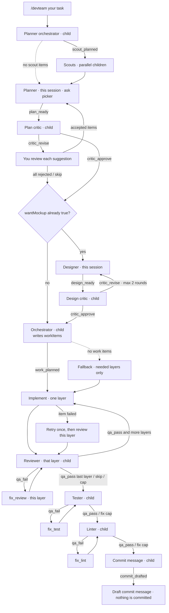

# pi-dev-team

A [Pi](https://pi.dev) coding-agent package that runs **`/devteam`**: one command that plans a change, optionally designs HTML mockups, then implements it with specialized agents and official stack skills.

This is a CLI extension, not a web app. Install it into Pi, then run `/devteam` in a coding session.

## What you type

```text
/devteam Add a settings page for profile and notification preferences
```

Answer the planner in the same chat with the option picker (including Other to type your own answer). Scouts run first so the planner already knows what is in the repo. After the plan critic runs, you accept or reject each suggestion; the planner patches only what you accepted, then implementation starts. HTML mockups run only if you already stored `wantMockup` during grilling.

Previous jobs stay on disk. `/devteam list` (or `/devteam continue list`) prints them; `/devteam continue 2` resumes that job.

### Commands

| Command | Effect |
| --- | --- |
| `/devteam <task>` | Start a **new** job (previous jobs are kept) |
| `/devteam continue` | Resume the **current** step after a stop or a failed child |
| `/devteam list` | Show saved jobs (newest first). Same as `/devteam continue list` |
| `/devteam continue <n\|id>` | Switch to that job **at its saved stage** (does not start a new planner) and keep executing |
| `/devteam skip` | Skip the current step (critic, review, remaining scouts, designer, remaining implement work, or a QA stage) |
| `/devteam status` | Print the run notebook |
| `/devteam mockup` | Print (and try to open) the HTML mockup |
| `/devteam clear` | Wipe run state and mockups |
| `/devteam stop` | Stop the current step: abort isolated children, abort the parent turn, and do not auto-advance |

There is no `/devteam ponytail`. If you already run [ponytail](https://github.com/dietrichgebert/ponytail) as a Pi extension, leave it installed. Isolated children **do not** pass `--no-extensions`, so your other extensions keep running.

## Workflow

1. **Planner orchestrator** (isolated) — splits the task into 2–4 read-only scouts
2. **Scouts** (isolated, parallel) — report existing files, types, and contracts into run state
3. **Planner** (this session) — grills you with selectable options, writes a spec that uses those findings
4. **Plan critic** (isolated) — itemized holes; you accept or reject each one
5. **Designer + design critic** — only if you stored `wantMockup` during grilling
6. **Orchestrator** (isolated) — splits the spec into work items with file allowlists
7. **Implementors** — only the layers this change needs (database → backend → frontend → general, skipping any that have no notes, files, or work items). Items with disjoint files in the same layer run together (default 3, cap 6). After each layer, a **reviewer** judges that layer; `qa_fail` sends that layer's implementor back to fix, then review runs again until it passes (max 3 fix rounds). Only then does the next layer start. If the orchestrator produces no items, the sequential path still runs **those needed layers only**, with the same per-layer review loop.
8. **Tester → linter** after the last layer's review passes, each with its own fix-it loop (max 3 rounds). Blocks vs notes. Fowler smells are notes. Hitting a cap continues to the next QA stage.
9. **Commit-message** — drafts a conventional message. **Does not commit.**

Planner and designer stay in the current Pi session. Everything else is an isolated `pi` child using the same model. When a role calls `devteam_handoff`, the next role starts immediately.

### The pipeline

The planner (and designer, if you asked for mockups) talk to you in this session. Critic suggestions pause for your Accept / Reject. Everything labelled *child* is a separate `pi`/`omp` process. `/devteam stop` halts the current step; `/devteam skip` skips it.



Each implementor-layer review and each tester/linter fix loop is capped at 3 rounds. Hitting a cap continues to the next layer (or the next QA stage).

### Inside the implement stage

Work items run layer by layer. Within a layer, items whose file lists cannot collide run at the same time:

```mermaid
flowchart LR
    Plan["workItems"] --> DB

    subgraph DB["database · wave 1"]
        d1["schema + migration<br/>prisma/**"]
    end

    subgraph BE["backend · wave 2, side by side"]
        b1["POST /od/snapshot<br/>src/server/routes/od/**"]
        b2["snapshot service<br/>src/server/services/**"]
    end

    subgraph FE["frontend · wave 3, side by side"]
        f1["snapshot list<br/>src/app/od/list.tsx"]
        f2["filter bar<br/>src/components/filters/**"]
        f3["empty + error states<br/>src/app/od/states.tsx"]
    end

    subgraph GEN["general · wave 4"]
        g1["seed script<br/>scripts/**"]
    end

    DB --> ReviewDB["Reviewer · database"] --> BE
    BE --> ReviewBE["Reviewer · backend"] --> FE
    FE --> ReviewFE["Reviewer · frontend"] --> GEN
    GEN --> ReviewGEN["Reviewer · general"]
```



`b1` and `b2` run together, as do `f1`, `f2` and `f3`, because no two of them claim the same paths. An item that lists overlapping paths waits for the next wave, and an item that lists no paths runs alone. The reviewer for a layer must pass (or hit the fix cap) before the next layer starts. The orchestrator finishes before any implementor starts; implementors never overlap with it.

Run state lives under the Pi **agent** directory, not the plugin install folder and not your repo. There is no `workflow_state` file inside `~/.omp/plugins/` (or wherever omp copies this package).

Stable aliases (created when a run starts):

```text
~/.omp/agent/devteam/workflow_state.json
~/.omp/agent/devteam/workflow_state.md
```

On Pi the same files are under `~/.pi/agent/devteam/`. Each job is a JSON file:

```text
~/.pi/agent/devteam/runs/<job-id>.json
~/.pi/agent/devteam/runs/<job-id>/mockup/index.html
```

`/devteam status` prints these paths. See `WHERE-IS-WORKFLOW-STATE.md` in the plugin folder.

A new `/devteam <task>` starts a **new job** and leaves earlier jobs in the list. `/devteam clear` deletes only the current job. `/new` and `/fork` do not delete saved jobs.

## Stack skills

Implementors always get the bundled `implement` and `tdd` skills. They also get **official** language/framework skills resolved at run time (Angular, React Native, React, Vue, .NET web API, Blazor, Postgres, EF Core, plus small tester add-ons). Those trees are **not** vendored here.

Resolution order:

1. Trusted `.pi/devteam.json` overrides
2. Skills already installed in Pi / `.agents/skills`
3. Sparse clone into `~/.pi/agent/devteam/skill-cache/`
4. If fetch fails: warn and continue with workflow skills only

Cap is **3** stack skills per child.

### Project config (trusted projects only)

`.pi/devteam.json`:

```json
{
  "skills": {
    "frontend": ["angular"],
    "backend": ["dotnet"],
    "database": ["postgres"],
    "extra": ["/abs/path/to/custom-skill"]
  },
  "paths": {
    "frontend": ["src/app/**", "src/components/**"]
  },
  "services": [
    { "name": "api", "root": "services/api", "layer": "backend", "test": ["go test ./..."] },
    { "name": "scoring", "root": "services/scoring", "layer": "backend", "test": ["pytest"] }
  ],
  "maxToolCalls": 200,
  "parallel": 3,
  "childIdle": 480,
  "repeatToolAbort": 8
}
```

Ids are catalog ids from `catalog/stacks.json`. An empty array means no stack skill for that layer. `extra` absolute paths are always appended.

### Multiple backend languages

Detection walks the tree for build manifests (`go.mod`, `pyproject.toml`, `package.json`, `.csproj`, and the rest) and turns each directory that owns one into a **service**. A Go API next to a Python worker becomes two backend services. The orchestrator can name a `service` on each work item (that service's root is the write allowlist if `files` is omitted). If it produces no items, the backend implementor still runs **once per service**, scoped to that service's files, skills, and test command.

If the scan guesses wrong, declare `services` in `.pi/devteam.json` or `.omp/devteam.json`. Config merges over detection by name or root.

The tester and linter then run each service's own command from that service's directory. Cross-service contracts belong in the spec — each pass cannot see the other service's code.

### Isolated child progress

The widget above the editor is one line: **step · role · elapsed** (`implement · backend · 1:23`). Child work is one **session transcript** block per role, updated in place (`plan critic · 0:12 · 4 tools` with the current actions underneath). Parallel scouts share a scout block; a later critic pass is a new block so it stays below the planner. The working loader and footer stay empty so that stack is not duplicated. Optional `progressEvery` toasts are off unless you set them in `devteam.json`. Streamed one-word tokens such as `hub` are ignored; only a tool call or a full sentence is logged. Child **stdout is kept in full** — it is the workflow's memory, not a log to trim.

A child that hits `maxToolCalls` is aborted instead of looping for thousands of calls. Defaults are **200** for implementors, reviewer, tester, and linter; **40** for scouts; **80** for the other specialists. A project `maxToolCalls` overrides those defaults (scouts still cap at 40). A child that produces no output for `childIdle` seconds (8 minutes by default) is aborted. A child that repeats the same **inspect** of the same target `repeatToolAbort` times in a row (8 by default) is aborted — `edit` / `write` / `bash` of one file is not a loop, and a bare `read` with no path is ignored. Oh My Pi JSON mode streams `thinking_delta` / `text_delta` tokens and `tool_stream_update` / `tool_execution_update` chunks; those are not counted as new tool calls. `/devteam stop` stops the current step; `/devteam continue` resumes it; `/devteam skip` skips it.

If a specialist exits cleanly without calling `devteam_handoff`, the parent infers the action from run state (critic notes, stored work items, findings, and so on) so the pipeline does not stall.

## Install and run

### Pi

Requires [Pi](https://pi.dev) and Node 22+.

```bash
pi -e ./src/index.ts
# or
pi install https://github.com/W4775/pi-dev-team
```

Then `/devteam …` in the TUI.

### Oh My Pi (omp)

Do **not** `omp plugin link` a checkout that still has a nested `.git` if your omp version errors on that symlink. Install from GitHub (copies into the plugin cache, then links that copy):

```bash
omp plugin install github:W4775/pi-dev-team
# or from a clone:
omp plugin install /absolute/path/to/pi-dev-team
```

This package is written for both hosts. Oh My Pi does not export Pi’s `withFileMutationQueue`; we fall back to a local file queue so the extension can load. Isolated children are still OS processes (the extension API cannot spawn omp’s in-process `task` subagents). On Oh My Pi they launch the way omp launches itself (`PI_SUBPROCESS_CMD`, the packed binary, or `omp.cmd` on Windows), pass `--yolo` (not Pi’s `-a`), map `find`/`ls` to `glob`, and send role/run-state via `DEVTEAM_ROLE` / `DEVTEAM_STATE`. `--skill` is a Pi flag; omp’s `--skills` is only a glob filter, so skill paths are listed in the child prompt for the `read` tool. If a child still dies with `Error: unknown flags: -a, --skill`, it is retried without those flags and later children skip them.

Run state on omp is under `~/.omp/agent/devteam/` (via `getAgentDir()`), including `workflow_state.json`. Project overrides: `.omp/devteam.json` or `.pi/devteam.json`.

After upgrading from an older install:

```bash
omp plugin uninstall pi-devteam
omp plugin uninstall pi-dev-team
omp plugin install github:W4775/pi-dev-team
```


## Tests

```bash
npm test
```

Unit tests cover permissions, run state, skip behavior, layer routing, block vs note, stack detection, catalog matching, and skill resolve order. They do not require Pi to be installed.

## Permissions

- Planner, critics, reviewer, and commit-message cannot edit the repo
- Designer writes mockups only via `devteam_mockup`
- Implementors may edit the tree but cannot write `.env` / key files and cannot `git commit`
- Optional per-layer path globs in `devteam.json`

## License

MIT for original pi-dev-team code. See `NOTICE` for third-party skill licenses (Matt Pocock MIT, Anthropic Apache-2.0).
