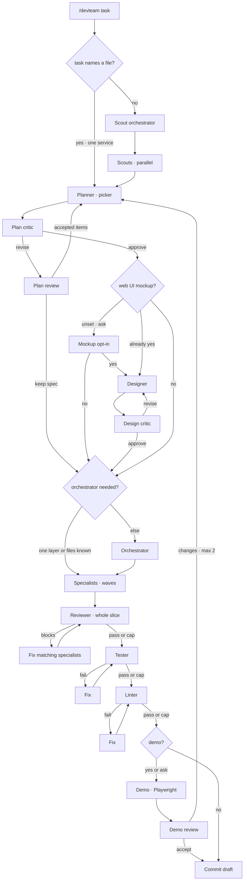
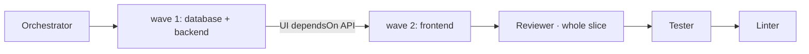

<div align="center">

# pi-dev-team

**One command. Full team. `/devteam` plans, builds, tests, and demos.**

Plans with scouts · Builds the slice · Tests + lints · Optional live demo

[](https://pi.dev)
[](https://github.com/coder/oh-my-pi)
[](https://nodejs.org)
[](./LICENSE)
[](#tests)

[Quick Start](#-quick-start) · [How it Works](#-how-it-works) · [Commands](#-commands) · [Config](#-config) · [Stack Skills](#-stack-skills)

</div>

---

## ⚡ Quick Start

```bash
# Pi
pi install https://github.com/W4775/pi-dev-team
# OMP
omp plugin install github:W4775/pi-dev-team
```

Then in any Pi/OMP session:

```text
/devteam Add a settings page for profile and notifications
```

Answer the planner's picker → review the critic → watch specialists build the slice → one review, then tests. Done.

> Previous jobs persist. `/devteam list` to resume. Each session owns its own run.

---

## 🧠 How it Works

**Scout → Plan → Build the slice → Prove once.**

| Step | What happens | Who |
|------|--------------|-----|
| **Scout** | Planner-orchestrator writes 2–4 scout items; read-only scouts map the repo. **Skipped** when the task already names a file (and the repo is not multi-service) | children |
| **Plan** | Planner grills you (picker), writes spec; critic may pause for Accept / Reject | you + child |
| **Design** | After the spec is approved, web+frontend jobs **ask** unless `wantMockup` was already set | you |
| **Build** | Implementation orchestrator splits **this slice** into file-disjoint work items — **skipped** when there is one layer, or every needed layer already has `filesToChange`. `database` / `backend` / `frontend` / `general` children run in waves (cap 6). `dependsOn` is the only ordering — not a layer waterfall | children |
| **Prove** | Reviewer on the **whole slice**, then tester, then linter. Pass/fail comes from **exit codes** and `[block]` findings, not a scan of the log dump. Each parks after 3 failed fix rounds until `/devteam continue`. Fixer implementors use `@slow` | children |
| **Demo** | After lint, web+frontend jobs **ask** unless `wantDemo` was already set. Headed Playwright, then you accept or request changes (max 2 demos) | you + child |
| **Ship** | Drafts a conventional commit — *never commits* | child |

Planner and designer stay in your session. Everyone else is an isolated child (`pi -a` / `omp --yolo @task`, `@slow` for implementors fixing a failed review/test/lint). A child that exits without the notebook evidence for its role **stops the job** instead of inferring a pass.

---

## 🎮 Commands

| Command | Does |
|---------|------|
| `/devteam <task>` | Start a new job |
| `/devteam continue` | Resume this step, or proceed past a parked cap |
| `/devteam list` | Show saved jobs |
| `/devteam continue 2` | Jump to job #2 at its saved stage |
| `/devteam skip` | Skip this step. During implement, remaining items go to review |
| `/devteam stop` | Abort the current child / step |
| `/devteam status` | Show notebook paths |
| `/devteam mockup` | Open the HTML mockup |
| `/devteam clear` | Wipe the current job |

At mockup or demo opt-in, answer **yes** or **no** in chat (or skip). Caps (review / test / lint / design-critic) park; continue and skip both proceed.

---

## 🔄 Pipeline



Design, review, test, and lint **park after their cap** (2 design rejects, 3 fix rounds). `/devteam continue` proceeds (design → implement, review → tester, test → lint, lint → demo or commit). `/devteam skip` does the same at those caps.

<details>
<summary>Inside the build: specialists, not a layer factory</summary>



Example: schema and API have disjoint files, so they share a wave; UI lists `dependsOn` the API item, so it waits. If all three are disjoint and have no `dependsOn`, they run in one wave (up to `parallel`, default 3, cap 6).

- `layer` on an item only picks the specialist (`database` / `backend` / `frontend` / `general`) and its write globs.
- Disjoint file lists run in the same wave, including across layers.
- `dependsOn` is the only ordering (migration before route, route before UI).
- No `workItems`? Needed specialists run in sequence, then the same single review.

</details>


## 📚 Project knowledge (OKF)

Trusted projects can keep **git-tracked OKF spec docs** under `.pi/knowledge/` — scouts write sourced repo facts; the planner mirrors each run's spec to `concepts/specs/<job-id>.md`. Orchestration still lives in `devteam_state`. Bootstrap also adds a minimal root **`AGENTS.md`** in consumer repos. See [KNOWLEDGE.md](./KNOWLEDGE.md) and [AGENTS.md](./AGENTS.md).

---

## ⚙️ Config

Create `.pi/devteam.json` (or `.omp/devteam.json` on OMP) — trusted projects only:

```json
{
  "skills": { "frontend": ["angular"], "backend": ["dotnet"], "database": ["postgres"] },
  "paths": { "frontend": ["src/app/**"] },
  "services": [{ "name": "api", "root": "services/api", "layer": "backend", "test": ["go test ./..."] }],
  "parallel": 3,
  "maxToolCalls": 200,
  "models": { "scout": "@smol", "reviewer": "@slow" }
}
```

- `skills` — catalog IDs from `catalog/stacks.json` (3 per child max, sparse-cloned)
- `services` — auto-detected via `go.mod`/`package.json`/`.csproj`; override when guess wrong
- `models` — alias per role (OMP `@task` by default, `@slow` for implementors on a fix round; Pi uses session model)
- `knowledge` — OKF bundle path, bootstrap, enable/disable (see KNOWLEDGE.md)
- `parallel` — how many specialists may run at once when file lists do not collide (default 3, cap 6)
- `maxToolCalls` / `childIdle` / `repeatToolAbort` — tune budgets

<details>
<summary>State locations & resolution</summary>

```
~/.pi/agent/devteam/runs/<job-id>.json          # Pi
~/.omp/agent/devteam/workflow_state.json        # OMP
~/.pi/agent/devteam/skill-cache/                # sparse clones
```

Each Pi session tracks its own current job. `/devteam status` prints paths. See `WHERE-IS-WORKFLOW-STATE.md`.

Resolution: `devteam.json` → installed skills → sparse clone → warn + continue.

</details>

---

## 🧩 Stack Skills

Bundled: `implement` + `tdd`. Plus official stacks (React, Vue, Angular, React Native, .NET, Blazor, Postgres, EF Core…) — not vendored, fetched on demand.

Progress: one-line widget `step · role · 1:23` + 40-line transcript blocks per role.

Budgets: `200` calls for builders/review/test/lint/demo, `40` scouts, `80` specialists; `childIdle 480s`, `repeatToolAbort 8`.

---

## 🔒 Permissions

| Role | Can |
|------|-----|
| Planner / Critics / Reviewer | Read-only |
| Designer | `devteam_mockup` only |
| Implementors | Edit tree, no `.env`/keys, no `git commit`, no `rm -rf` / git rewrite / package installs / curl / sudo |
| Demo | `serve` + Playwright, writes `demo/` only |

Optional per-layer `paths` globs further restrict writes.

---

## 📦 Install Details

**Pi** — Node 22+:

```bash
pi -e ./src/index.ts          # dev
pi install https://github.com/W4775/pi-dev-team
```

**OMP** — don't `omp plugin link` a checkout with nested `.git` on older OMP:

```bash
omp plugin install github:W4775/pi-dev-team
omp plugin install /abs/path/to/pi-dev-team  # from clone
```

Upgrade: `omp plugin uninstall pi-dev-team && omp plugin install github:W4775/pi-dev-team`

OMP children use `PI_SUBPROCESS_CMD` / `omp --yolo` + `DEVTEAM_ROLE`.

---

## ✅ Tests

```bash
npm test          # unit + e2e harness, no Pi needed
npm run lint      # oxlint
npm run fmt:check # oxfmt (fix: npm run fmt)
```

Covers: permissions, per-session state, teardown, slice waves, review-once, fail-closed handoffs, block vs note, stack detection, model tiers, transcript caps.

---

<div align="center">

MIT for pi-dev-team · See `NOTICE` for skill licenses (Matt Pocock MIT, Anthropic Apache-2.0)

*PRs welcome — keep it thin, keep it tested.*

</div>

⚠ 2 unresolved conflicts detected
- ours = HEAD
- theirs = 97e6c8c (feat: add OKF project knowledge bundles and AGENTS.md bootstrap)
NOTICE: Inspect a block by reading `conflict://<N>` (add `/ours` / `/theirs` / `/base` to render a single side). Resolve with `write({ path: "conflict://<N>", content })`, or bulk-resolve every registered conflict with `write({ path: "conflict://*", content })`. Writes replace ONLY the marker block (markers + all sides) — never repeat the lines before/after it; they stay in place.
`content` shorthand: a line that is exactly `@ours` / `@theirs` / `@base` / `@both` expands to that recorded section. `@both` is ours-then-theirs with no separator — only for additive conflicts where each side adds something different; NEVER for competing edits of the same lines (pick a side or write the combined text). Lines that are not a token pass through verbatim, so `"// keep both\n@ours\n@theirs"` literally writes the comment, then ours, then theirs.
Per-id bulk: `write({ path: "conflict://*", content: "1: @ours\n2: @theirs\n…" })` resolves each listed id with that side in ONE call — the cheapest way through many pick-one conflicts; unlisted ids stay registered.
Resolve each block faithfully: keep one side (`@ours`/`@theirs`), or combine them when both intents apply — never invent content beyond the recorded sides, and never stack both sides of competing edits. Resolve several conflicts in a single turn by issuing multiple `write` calls at once; ids stay valid as earlier blocks are resolved.

──── #4  L167-175 ────
<<< ours
- `models` — alias per role (OMP `@task` by default, `@slow` for implementors on a fix round; Pi uses session model)
- `parallel` — how many specialists may run at once when file lists do not collide (default 3, cap 6)
- `maxToolCalls` / `childIdle` / `repeatToolAbort` — tune budgets
>>> theirs
- `models` — alias per role (OMP `@task` by default; Pi uses session model)
- `knowledge` — OKF bundle path, bootstrap, enable/disable (see KNOWLEDGE.md)
- `parallel` / `maxToolCalls` / `childIdle` / `repeatToolAbort` — tune concurrency & budgets

──── #3  L242-246 ────
<<< ours
npm test          # unit + e2e harness, no Pi needed
>>> theirs
npm test          # 191 tests, no Pi needed
⚠ 1 unresolved conflict detected
- ours = HEAD
- theirs = 97e6c8c (feat: add OKF project knowledge bundles and AGENTS.md bootstrap)
NOTICE: Inspect a block by reading `conflict://<N>` (add `/ours` / `/theirs` / `/base` to render a single side). Resolve with `write({ path: "conflict://<N>", content })`, or bulk-resolve every registered conflict with `write({ path: "conflict://*", content })`. Writes replace ONLY the marker block (markers + all sides) — never repeat the lines before/after it; they stay in place.
`content` shorthand: a line that is exactly `@ours` / `@theirs` / `@base` / `@both` expands to that recorded section. `@both` is ours-then-theirs with no separator — only for additive conflicts where each side adds something different; NEVER for competing edits of the same lines (pick a side or write the combined text). Lines that are not a token pass through verbatim, so `"// keep both\n@ours\n@theirs"` literally writes the comment, then ours, then theirs.
Per-id bulk: `write({ path: "conflict://*", content: "1: @ours\n2: @theirs\n…" })` resolves each listed id with that side in ONE call — the cheapest way through many pick-one conflicts; unlisted ids stay registered.
Resolve each block faithfully: keep one side (`@ours`/`@theirs`), or combine them when both intents apply — never invent content beyond the recorded sides, and never stack both sides of competing edits. Resolve several conflicts in a single turn by issuing multiple `write` calls at once; ids stay valid as earlier blocks are resolved.

──── #5  L237-241 ────
<<< ours
npm test          # unit + e2e harness, no Pi needed
>>> theirs
npm test          # 191 tests, no Pi needed