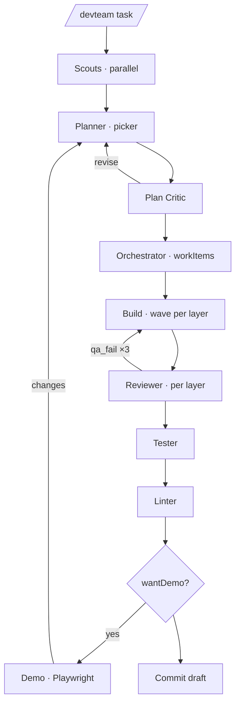
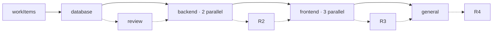

<div align="center">

# pi-dev-team

**One command. Full team. `/devteam` plans, builds, tests, and demos.**

Plans with scouts · Builds layer-by-layer · Tests + lints · Optional live demo

[](https://pi.dev)
[](https://github.com/coder/oh-my-pi)
[](https://nodejs.org)
[](./LICENSE)
[](#tests)

[Quick Start](#-quick-start) · [How it Works](#-how-it-works) · [Commands](#-commands) · [Config](#-config) · [Stack Skills](#-stack-skills)

</div>

---

## ⚡ Quick Start

```bash
# Pi
pi install https://github.com/W4775/pi-dev-team
# OMP
omp plugin install github:W4775/pi-dev-team
```

Then in any Pi/OMP session:

```text
/devteam Add a settings page for profile and notifications
```

Answer the planner's picker → review the critic → watch layers build. Done.

> Previous jobs persist. ` /devteam list` to resume. Each session owns its own run.

---

## 🧠 How it Works

**Scout → Plan → Build → Prove.**

| Step | What happens | Who |
|------|--------------|-----|
| **Scout** | 2–4 parallel read-only scouts map your repo | child |
| **Plan** | Planner grills you (picker), writes spec; critic patches it | you + child |
| **Design** | HTML mockup *only if* you opted `wantMockup` | you |
| **Build** | Orchestrator splits spec → layers (`database → backend → frontend → general`) run in parallel waves (cap 6), reviewer gates each layer (3 rounds) | children |
| **Prove** | Tester → Linter (3 fix rounds each) | children |
| **Demo** | Headed Playwright drives your app *only for web UIs* with `wantDemo` | child |
| **Ship** | Drafts conventional commit — *never commits* | child |

All remotes are isolated processes. Planner/designer stay in your session; children run as `pi -a` / `omp --yolo @task`.

---

## 🎮 Commands

| Command | Does |
|---------|------|
| `/devteam <task>` | Start new job |
| `/devteam continue` | Resume current step |
| `/devteam list` | Show saved jobs |
| `/devteam continue 2` | Jump to job #2 at saved stage |
| `/devteam skip` | Skip critic / review / QA / demo |
| `/devteam stop` | Abort current step |
| `/devteam status` | Show notebook paths |
| `/devteam mockup` | Open HTML mockup |
| `/devteam clear` | Wipe current job |

---

## 🔄 Pipeline



Waves run together when file lists don't collide. No `workItems`? Falls back to needed layers only.

<details>
<summary>Inside a build wave</summary>



Reviewer must pass (or hit 3-round cap) before next layer starts.

</details>

---

## ⚙️ Config

Create `.pi/devteam.json` (or `.omp/devteam.json` on OMP) — trusted projects only:

```json
{
  "skills": { "frontend": ["angular"], "backend": ["dotnet"], "database": ["postgres"] },
  "paths": { "frontend": ["src/app/**"] },
  "services": [{ "name": "api", "root": "services/api", "layer": "backend", "test": ["go test ./..."] }],
  "parallel": 3,
  "maxToolCalls": 200,
  "models": { "scout": "@smol", "reviewer": "@slow" }
}
```

- `skills` — catalog IDs from `catalog/stacks.json` (3 per child max, sparse-cloned)
- `services` — auto-detected via `go.mod`/`package.json`/`.csproj`; override when guess wrong
- `models` — alias per role (OMP `@task` by default; Pi uses session model)
- `parallel` / `maxToolCalls` / `childIdle` / `repeatToolAbort` — tune concurrency & budgets

<details>
<summary>State locations & resolution</summary>

```
~/.pi/agent/devteam/runs/<job-id>.json          # Pi
~/.omp/agent/devteam/workflow_state.json        # OMP
~/.pi/agent/devteam/skill-cache/                # sparse clones
```

Each Pi session tracks its own current job. `/devteam status` prints paths. See `WHERE-IS-WORKFLOW-STATE.md`.

Resolution: `devteam.json` → installed skills → sparse clone → warn + continue.

</details>

---

## 🧩 Stack Skills

Bundled: `implement` + `tdd`. Plus official stacks (React, Vue, Angular, React Native, .NET, Blazor, Postgres, EF Core…) — not vendored, fetched on demand.

Progress: one-line widget `step · role · 1:23` + 40-line transcript blocks per role.

Budgets: `200` calls for builders/review/test/lint/demo, `40` scouts, `80` specialists; `childIdle 480s`, `repeatToolAbort 8`.

---

## 🔒 Permissions

| Role | Can |
|------|-----|
| Planner / Critics / Reviewer | Read-only |
| Designer | `devteam_mockup` only |
| Implementors | Edit tree, no `.env`/keys, no `git commit` |
| Demo | `serve` + Playwright, writes `demo/` only |

Optional per-layer `paths` globs further restrict writes.

---

## 📦 Install Details

**Pi** — Node 22+:

```bash
pi -e ./src/index.ts          # dev
pi install https://github.com/W4775/pi-dev-team
```

**OMP** — don't `omp plugin link` a checkout with nested `.git` on older OMP:

```bash
omp plugin install github:W4775/pi-dev-team
omp plugin install /abs/path/to/pi-dev-team  # from clone
```

Upgrade: `omp plugin uninstall pi-dev-team && omp plugin install github:W4775/pi-dev-team`

OMP children use `PI_SUBPROCESS_CMD` / `omp --yolo` + `DEVTEAM_ROLE`.

---

## ✅ Tests

```bash
npm test          # 182 tests, no Pi needed
npm run lint      # oxlint
npm run fmt:check # oxfmt (fix: npm run fmt)
```

Covers: permissions, per-session state, teardown, layer routing, block vs note, stack detection, model tiers, transcript caps.

---

<div align="center">

MIT for pi-dev-team · See `NOTICE` for skill licenses (Matt Pocock MIT, Anthropic Apache-2.0)

*PRs welcome — keep it thin, keep it tested.*

</div>
